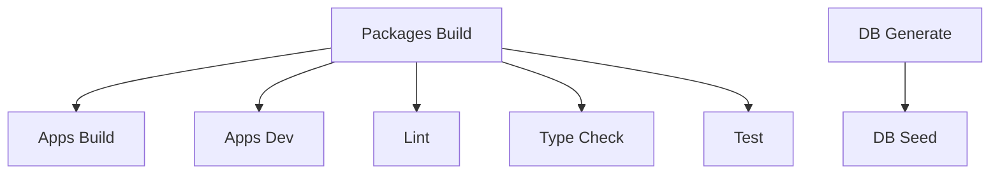

# 🚀 Turborepo Configuration

This document explains the Turborepo setup for the Final Golf SaaS monorepo.

## 📋 Pipeline Overview

Our `turbo.json` configures the following task pipelines:

### 🏗️ **Build Pipeline**
- **Task**: `build`
- **Dependencies**: `^build` (builds dependencies first)
- **Caching**: Full caching with Next.js and dist outputs
- **Environment**: NODE_ENV, DATABASE_URL, NEXTAUTH_*

### 🔧 **Development Pipeline**
- **Task**: `dev`
- **Dependencies**: `^build` (ensures packages are built)
- **Caching**: Disabled (persistent development servers)
- **Environment**: All database and auth variables

### ✅ **Quality Pipelines**
- **`lint`**: ESLint with caching, depends on builds
- **`type-check`**: TypeScript validation with tsbuildinfo caching
- **`test`**: Vitest/Jest with coverage output caching
- **`format`**: Prettier formatting (no cache for consistency)

### 🗄️ **Database Pipelines**
- **`db:generate`**: Prisma client generation (cached)
- **`db:migrate`**: Database migrations (no cache)
- **`db:seed`**: Database seeding (no cache)

## 🎯 **Task Dependencies**



## ⚡ **Caching Strategy**

### **Cached Tasks**
- `build` - Full build outputs cached
- `lint` - ESLint cache file
- `type-check` - TypeScript build info
- `test` - Test results and coverage
- `db:generate` - Prisma client generation

### **Non-Cached Tasks**
- `dev` - Development servers (persistent)
- `start` - Production servers (persistent)
- `db:migrate` - Database changes (side effects)
- `format` - Code formatting (consistency)

## 🌐 **Remote Caching**

Configured for Vercel Remote Cache:
- **Team**: `final-golf-saas`
- **API**: Vercel artifacts API
- **Signature**: Enabled for security

### **Setup Remote Cache**
```bash
# Login to Vercel (optional)
npx turbo login

# Link to team
npx turbo link

# Set environment variables
export TURBO_TOKEN="your-token"
export TURBO_TEAM="final-golf-saas"
```

## 🔧 **Usage Examples**

### **Development**
```bash
# Start all apps in development
pnpm dev

# Build all packages and apps
pnpm build

# Run tests across all packages
pnpm test

# Lint all code
pnpm lint
```

### **Single Package Operations**
```bash
# Build specific package
pnpm turbo build --filter=@gbs/database

# Test specific app
pnpm turbo test --filter=customer

# Lint with dependencies
pnpm turbo lint --filter=@gbs/ui...
```

### **Advanced Operations**
```bash
# Force rebuild (ignore cache)
pnpm turbo build --force

# Dry run to see what would execute
pnpm turbo build --dry-run

# Parallel execution
pnpm turbo build --parallel

# Filter by changed files
pnpm turbo build --filter="...[HEAD^1]"
```

## 🎛️ **Configuration Details**

### **Global Dependencies**
Files that invalidate all caches when changed:
- `.env*` files
- `tsconfig.json`
- `.eslintrc.*`
- `tailwind.config.js`
- `next.config.js`

### **Environment Variables**
- **Global**: NODE_ENV, CI, VERCEL, DATABASE_URL
- **Development**: REDIS_URL, NEXTAUTH_*
- **CI/CD**: GITHUB_TOKEN, TURBO_TOKEN

### **Input/Output Patterns**
- **Inputs**: Source files, config files, env files
- **Outputs**: Built assets, cache files, generated code
- **Exclusions**: Cache directories, temporary files

## 🚨 **Troubleshooting**

### **Common Issues**

1. **Cache not working**
   ```bash
   # Clear Turbo cache
   pnpm turbo build --force
   ```

2. **Dependencies not built**
   ```bash
   # Check dependency graph
   pnpm turbo build --graph
   ```

3. **Environment variable issues**
   ```bash
   # Verify env vars are passed correctly
   pnpm turbo build --env-mode=strict
   ```

### **Performance Optimization**

- Use `--parallel` for independent tasks
- Filter operations with `--filter`
- Monitor cache hit rates with `--summarize`
- Profile builds with `--profile`

## 📊 **Metrics & Monitoring**

Enable build analytics:
```bash
# Generate build summary
pnpm turbo build --summarize

# Profile build performance
pnpm turbo build --profile
```

This configuration optimizes the monorepo for:
- ⚡ Fast incremental builds
- 🔄 Efficient dependency management  
- 📦 Smart caching strategies
- 🚀 Parallel task execution
- 🌐 Remote cache sharing